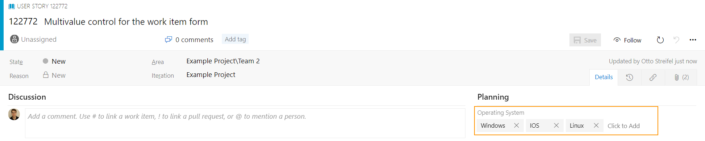
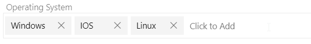
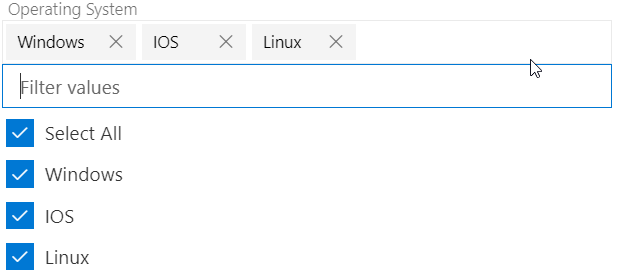
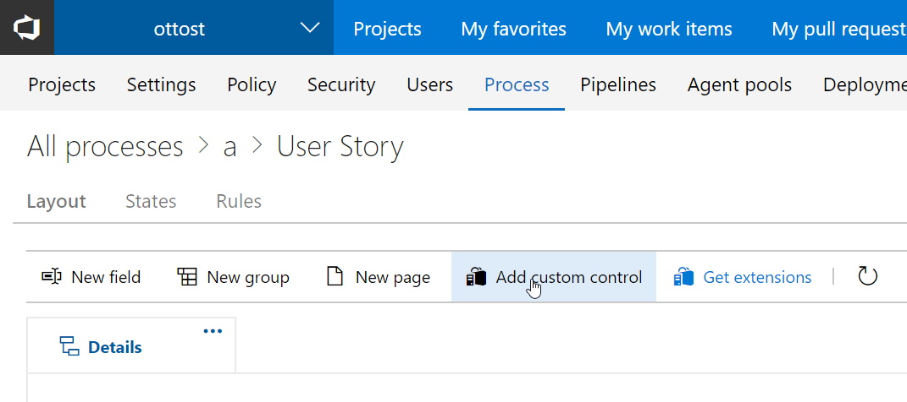
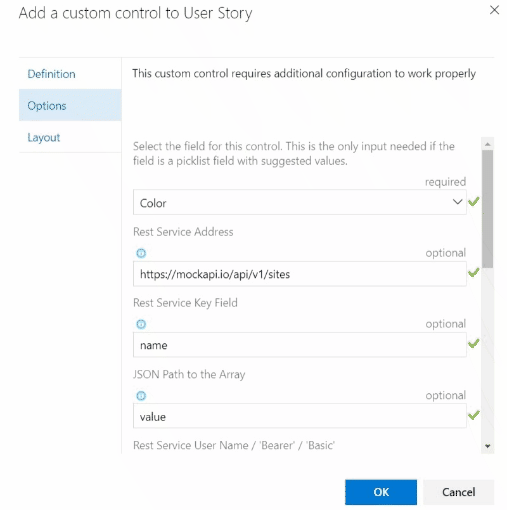

# REST Data Mapping Multivalue
#### An Azure DevOps Work Item Form Extension

This is an extension for Azure DevOps to load REST data into a multiview.

https://marketplace.visualstudio.com/items?itemName=bracken-b5.vsts-extensions-rest-multivalue-control-dev

# Select multiple values for your fields

# Expand the control only when needed

# How to get started
## Azure DevOps Services

Navigate to your work item form customization page and add a REST Multivalue control.

## Options
Edit the control extension so it can use the right field to store your selection and obtain the set of values to display.

